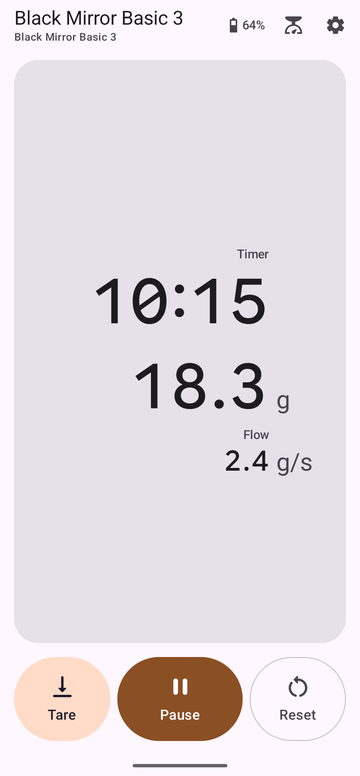
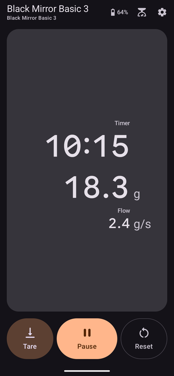
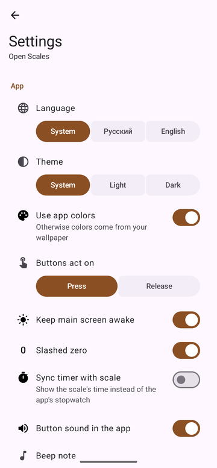
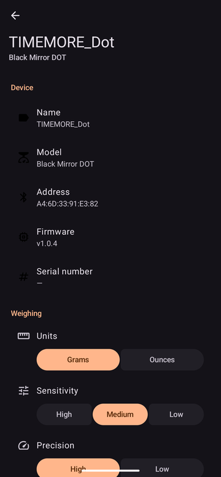

# Open Scales

An open Android app for **Timemore Black Mirror** coffee scales. The Bluetooth protocol was reverse-engineered
from the official app (`blackmirror_2.5.0_build125_release_20260910.apk`).

| Code name | Model ID | Notes |
|---|---|---|
| DOT | TES017 | tested on a real scale; it advertises itself as `TIMEMORE_Dot` |
| Basic 3 | TES016 | not tested on hardware |
| ESPRO | TES015 | not tested on hardware; no retail product under this name could be found — it may be unreleased or sold under another name |
| — | TES08 | older dual-platform scale, legacy protocol, not tested on hardware |

The model names are **code names** from the official app's source (`enum ScaleModel { OLD_DOUBLE, DOT, ESPRO, BASIC3 }`,
drawables such as `ic_brew_espro`); the app has no user-facing product names for them, and retail names may differ.
`TES0xx` are the model identifiers the scales report over Bluetooth. Open Scales shows these code names in the UI
(for example "Black Mirror ESPRO").

<p>
  
  
  
  
</p>

## Features

- **Live readings:** weight, flow rate and brew timer from the scale about 10 times a second, shown the moment
  they arrive. Large tabular digits aligned on one axis, so numbers don't jump as they change.
- **Scale buttons in the app:** Tare, Start/Pause, Reset. They fire on touch like the physical buttons
  (configurable), with an optional beep.
- **App-owned timer:** keeps counting without the scale and across link drops. If the scale's timer is already
  running when the app connects (for example after an app update), the app picks it up.
- **Connection that takes care of itself:** remembers your scale, reconnects automatically, shows one clear status.
- **Scale settings:** units, sensitivity, precision, auto power-off, button sound and brightness (per model),
  rename, power off, factory reset, forget. Found in the scale's details on the Scales screen.
- **English and Russian,** with an in-app language choice that can differ from the system language.
- **Light or dark theme** independent of the system, and the app's own palette or your wallpaper colors
  (Android 12+).
- **Keeps the screen on** on the main screen during a brew; landscape layout.

Tested on a real DOT (TES017, firmware v1.0.4) with a Pixel 9 Pro XL (Android 17). ESPRO and Basic 3 use the same
protocol for the features above according to the official app; TES08 support is implemented from its legacy
protocol. None of these three have been tested on hardware.

## Not supported

Open Scales is a scale companion: readings, timer, buttons and scale settings. It deliberately leaves out parts
of the official app:

- **ESPRO espresso mode.** In the official app the ESPRO has its own espresso flow: the scale waits for a trigger
  (most likely the first flow into the cup) and then runs a shot timer that its firmware controls — the app can't
  pause it. It is driven by the mode/stage command `0x08` with confirmations via `0x09`. This is inferred from the
  official app's code and logs, not verified on an ESPRO. Open Scales only reads the mode at connect time and
  treats the ESPRO like the other models.
- **Coffee-to-water ratio control.** The scale sends ratio-control frames (`0x04`) after the timer starts; they are
  ignored.
- **Charging indicator.** The first byte of the battery reply looks like a charging status, but its encoding isn't
  confirmed, so only the percentage is shown.
- **Firmware updates.** The official app updates firmware over Cypress OTA with an image from Timemore's server
  (needs a Timemore account). Open Scales doesn't update firmware.
- **Everything outside the scale:** Timemore account and cloud, bean inventory
  and brew history, sharing, QR codes, help center.

## Install

There are no published releases yet. Build a release APK and install it:

```sh
export JAVA_HOME=/opt/homebrew/opt/openjdk@17/libexec/openjdk.jdk/Contents/Home
./gradlew :app:assembleRelease          # app/build/outputs/apk/release/app-release.apk, ~1.8 MB
tools/dev.sh install release            # or: adb install -r app/build/outputs/apk/release/app-release.apk
```

The release build is signed with the debug key: fine for your own phone, not for distribution.
Requires Android 8.0 (API 26) or newer and Bluetooth LE.

## Development

- Kotlin, Jetpack Compose, Material 3 Expressive (`material3 1.5.0-alpha28`), minSdk 26, compile/targetSdk 37.
- JDK 17 is required. Full check (tests, debug build, lint — lint must report "No issues found"):

  ```sh
  ./gradlew :app:testDebugUnitTest :app:assembleDebug :app:lintDebug
  ```

- `tools/dev.sh` — device and emulator harness: install, launch, screenshots, filtered BLE logcat, emulator
  control. Run it without arguments for the list of commands.
- Debug builds have a BLE log screen (bug icon on the main screen) with export, timer ticks and a main-thread
  stall watchdog.

### Structure

```
protocol/  pure Kotlin: frames (A5 5A … CRC16/Modbus), message decoder, legacy TES08 codec, advertisements
ble/       BleTransport over BluetoothGatt (one GATT operation in flight), scanner, BLE log (debug)
session/   command queue, ScaleSession (bond → MTU → notify → handshake → READY), ScaleRepository
           (current session, remembered scale, auto-reconnect, app-owned timer)
data/      settings (DataStore), language, theme and appearance stores
sound/     button beep (AudioTrack)
ui/        one Activity per screen: main screen, Scales (search and remembered scale), scale details,
           app settings; debug BLE log
```

### Specs and docs

- Behavior is specified with [OpenSpec](https://github.com/Fission-AI/OpenSpec): specs in `openspec/specs/`,
  changes and their history in `openspec/changes/` (`openspec list`, `openspec list --specs`).
  Artifacts are written in Russian.

## Licenses

- The readout digits use a subset of [Google Sans Flex](https://github.com/google/fonts/tree/main/ofl/googlesansflex),
  renamed "Open Scales Digits", under the SIL Open Font License 1.1 (`app/src/main/assets/licenses/readout_digits_OFL.txt`).
  Regenerate it with `tools/make-digits-font.sh`.
- Open Scales is licensed under the [GNU General Public License v3.0](LICENSE).
- Timemore and Black Mirror are trademarks of their owner; this project is not affiliated with Timemore.
